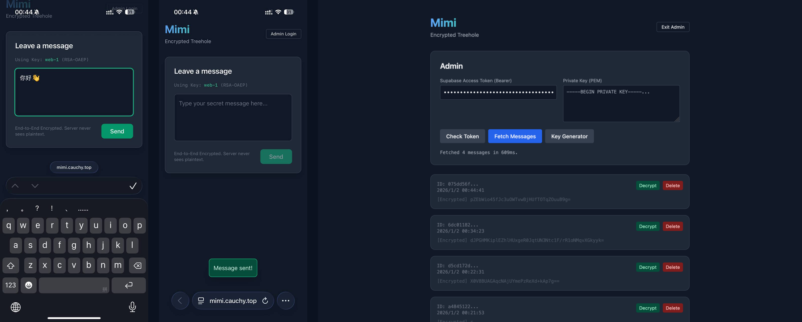

# Mimi

Encrypted treehole.

Anyone can submit an encrypted message.
Only admins can read or delete messages.
The database stores ciphertext plus crypto metadata only.
The server never sees plaintext.

## Preview

## Stack

- Cloudflare Workers for the API and the static page
- Supabase Postgres with RLS

## Database setup

Apply migrations in order.

1) `supabase/migrations/0001_encrypted_guestbook.sql`
2) `supabase/migrations/0002_treehole_admin_only_read.sql`
3) `supabase/migrations/0003_messages_hybrid_encryption_fields.sql`
4) `supabase/migrations/0004_lock_encryption_public_keys_write.sql`

## Admin model

Admins are stored in `public.admins`.
Message read and delete require a Supabase access token for a user in that table.

Encryption public keys are readable by everyone.
Key publishing is locked down at the database level.
Do it via Supabase SQL Editor or another trusted channel.
Do not rely on a browser token to manage keys.

## Local dev

Install dependencies.

`bun install`

Create `.env` from `.env.example` and fill values you need.
Generate `.dev.vars` from Supabase project settings.

`bun run sync-vars`

Start the worker locally.

`bun run dev`

## Deploy

`bun run deploy`

## API

- `GET /v1/health`
- `GET /v1/crypto/public-keys`
- `POST /v1/messages`
- `GET /v1/messages?limit=50&offset=0`
- `DELETE /v1/messages/:id`
- `GET /v1/admin/status`
